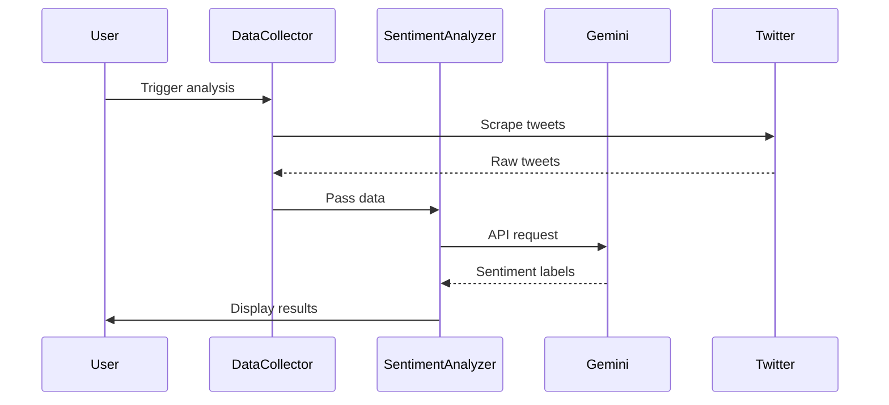

# XTweets Live Sentiment Analysis 🔍

[](https://github.com/end-9214/XTweets-live-sentiment-analysis/stargazers)
[](https://www.python.org/)

Real-time Twitter sentiment analysis system using CrewAI agents powered by Google Gemini. Analyzes latest tweets from popular accounts and provides interactive insights.

GitHub Repository: [https://github.com/end-9214/XTweets-live-sentiment-analysis](https://github.com/end-9214/XTweets-live-sentiment-analysis)

## 🌟 Features

- Live Twitter data scraping for 5 popular accounts
- AI-powered sentiment classification (Positive/Neutral/Negative)
- Interactive terminal interface
- JSON data persistence
- Rate-limited API handling

## 🚀 Getting Started

### Prerequisites
- Python 3.11+
- Google Gemini API key

### Installation
```bash
# Clone repository
git clone https://github.com/end-9214/XTweets-live-sentiment-analysis.git
cd XTweets-live-sentiment-analysis

# Install dependencies
pip install google-generativeai crewai ntscraper

# Configure API key (edit sentiment_analyzer.py)
nano sentiment_analyzer.py
# Replace "your-api-key-here" with your Gemini API key
```

## 🤖 CrewAI Agent Architecture

### Agent Workflow


### X Data Collector Agent
**Key Configuration:**
```python
Agent(
    name="X Data Collector",
    role="Twitter data scraping specialist",
    goal="Collect latest 5 tweets from 5 target accounts",
    backstory="Expert in social media data harvesting",
    llm=gemini_llm,
    verbose=True
)
```
**Functions:**
- Uses ntscraper for Twitter data collection
- Implements error handling for failed requests
- Maintains data structure consistency
- Ensures recent tweet freshness

### Sentiment Analyzer Agent
**Key Configuration:**
```python
Agent(
    name="Sentiment Analyzer",
    role="AI sentiment classification engine",
    goal="Accurate real-time sentiment analysis",
    backstory="Advanced NLP model specialist",
    llm=gemini_llm,
    verbose=True
)
```
**Analysis Workflow:**
1. Receives raw tweets from Data Collector
2. Processes through Google Gemini API
3. Implements 1.5s delay between requests
4. Formats results for user interaction
5. Handles API errors gracefully

## 📊 Sample Output

```json
// sentiments.json
{
  "elonmusk": [
    {
      "text": "Exciting new AI developments coming soon!",
      "sentiment": "positive"
    },
    {
      "text": "Reminder: Tesla earnings call tomorrow",
      "sentiment": "neutral"
    }
  ]
}
```

## 🛠️ Usage

```bash
python sentiment_analyzer.py

# Follow terminal prompts to:
# 1. Collect fresh tweets
# 2. Analyze sentiments
# 3. Interactive query mode
```

**Chat Interface Example:**
```bash
Which user's sentiments? > nytimes

--- Latest sentiments for @nytimes ---
1. NEUTRAL: Breaking: International climate agreement reached...
2. NEGATIVE: Report shows increase in global poverty rates...
```

## 📂 Repository Structure
```
├── sentiment_analyzer.py     # Main application
├── tweets_data.json          # Raw tweet storage
├── sentiments.json           # Analysis results
├── requirements.txt          # Dependency list
└── README.md                 # Documentation
```

## 📈 Performance Notes

- Scrapes 25 tweets (5 users × 5 tweets) in ~30 seconds
- Processes sentiments in ~45 seconds (with API delays)
- Stores results in human-readable JSON format

## 🤝 Contributing

PRs welcome! Please open issues for:
- Additional platform support
- Enhanced visualization features
- Improved error handling
