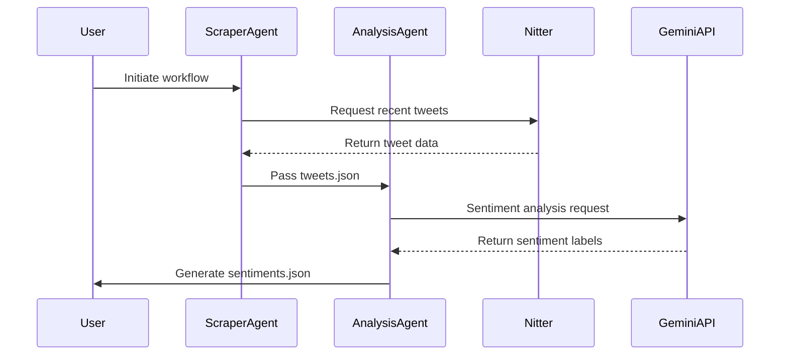

# XTweets Live Sentiment Analysis 🔍

[](https://github.com/end-9214/XTweets-live-sentiment-analysis/stargazers)
[](https://www.python.org/)

Automated Twitter sentiment analysis pipeline using CrewAI agents powered by Google Gemini. Analyzes recent tweets from specified accounts using Nitter and generates sentiment reports.

GitHub Repository: [https://github.com/end-9214/XTweets-live-sentiment-analysis](https://github.com/end-9214/XTweets-live-sentiment-analysis)

## 🌟 Features

- Nitter-based tweet scraping
- Multi-agent CrewAI architecture
- Google Gemini-powered sentiment analysis
- JSON data persistence
- Error handling for scraping issues
- Modular tool-based design

## 🚀 Getting Started

### Prerequisites
- Python 3.11+
- Google Gemini API key

### Installation
```bash
# Clone repository
git clone https://github.com/end-9214/XTweets-live-sentiment-analysis.git
cd XTweets-live-sentiment-analysis

# Install dependencies
pip install python-dotenv crewai google-generativeai ntscraper

# Configure environment variables (create .env file)
echo "GEMINI_API_KEY=your_gemini_key_here" > .env
```

## 🤖 CrewAI Agent Architecture

### Agent Workflow


### Social Media Scraper Agent
**Configuration:**
```python
Agent(
    role='Social Media Scraper',
    goal='Collect recent tweets',
    backstory='Expert in data collection',
    tools=[tweet_scraper],
    verbose=True
)
```
**Capabilities:**
- Collects last 5 tweets from specified handles
- Uses Nitter for scraping
- Stores raw data in tweets.json
- Error handling for invalid accounts

### Sentiment Analyst Agent
**Configuration:**
```python
Agent(
    role='Sentiment Analyst',
    goal='Analyze sentiment',
    backstory='NLP specialist',
    tools=[sentiment_analyzer],
    verbose=True
)
```
**Analysis Process:**
1. Reads raw tweets from tweets.json
2. Uses Gemini Pro for sentiment classification
3. Appends sentiment labels to tweet data
4. Stores results in sentiments.json
5. Handles API errors gracefully

## 📊 Sample Output Structure

```json
// sentiments.json
{
  "elonmusk": [
    {
      "id": "123456789",
      "date": "2024-03-15T12:34:56",
      "content": "Exciting product launch next week!",
      "sentiment": "positive"
    }
  ],
  "BillGates": [
    {
      "id": "987654321",
      "date": "2024-03-15T11:11:11",
      "content": "Climate change report findings...",
      "sentiment": "neutral"
    }
  ]
}
```

## 🛠️ Usage

```bash
python main_script.py

# Output files will be created:
# - tweets.json (raw tweet data)
# - sentiments.json (analysis results)
```

## 📂 Repository Structure
```
├── main_script.py            # Core CrewAI workflow
├── tweets.json               # Raw tweet storage
├── sentiments.json           # Analyzed results
├── .env.example              # Environment template
└── README.md                 # Documentation
```

## ⚡ Performance
- Typical runtime: 1-2 minutes (15 tweets across 3 accounts)
- JSON data structure for easy integration
- Modular architecture for feature additions

## 🤝 Contributing

Contribution areas:
- Enhanced visualization modules
- Additional platform integrations
- Performance optimizations
- Extended error handling

PRs welcome! Please open issues for discussion.
